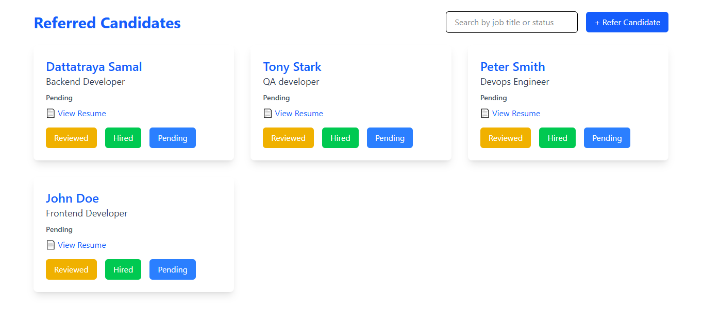

<h1>🎯 Referral System App</h1>
    
A full-stack application built with <strong>React</strong> (frontend) and <strong>Node.js + Express + MongoDB</strong> (backend).

    <blockquote>✅ Includes form validations, resume uploads, error handling, and clean UI.</blockquote>

   <h2>📸 Dashboard Screenshot</h2>
    

   <h2>✨ Features</h2>
    <ul>
        <li>Refer new candidates (Name, Email, Phone, Job Title, PDF Resume)</li>
        <li>View all referred candidates</li>
        <li>Update candidate status (Pending, Reviewed, Hired)</li>
        <li>Form validations on frontend & backend</li>
        <li>Resume uploads stored on server</li>
        <li>Error handling and user feedback</li>
    </ul>

   <h2>🚀 Running the Project Locally</h2>

   <h3>Backend</h3>
    <pre><code>
   cd backend
npm install
nodemon server.js
    </code></pre>

   
Backend will run on: <code>http://localhost:8000</code>

   <h3>Frontend</h3>
    <pre><code>
cd frontend/project
npm install
npm run dev
    </code></pre>

   
Frontend will run on: <code>http://localhost:5173</code>

 <h2>⚙️ API Endpoints</h2>
    <table>
        <thead>
            <tr><th>Method</th><th>Endpoint</th><th>Description</th></tr>
        </thead>
        <tbody>
            <tr><td>GET</td><td><code>/api/candidates</code></td><td>Fetch all candidates</td></tr>
            <tr><td>POST</td><td><code>/api/candidates</code></td><td>Refer a new candidate</td></tr>
            <tr><td>PUT</td><td><code>/api/candidates/:id/status</code></td><td>Update candidate status</td></tr>
        </tbody>
    </table>

   <h2>📌 Assumptions & Limitations</h2>
    <ul>
        <li>Phone must be 10 digits</li>
        <li>Email must be valid</li>
        <li>Resume must be a PDF</li>
        <li>No authentication implemented</li>
        <li>Files stored locally</li>
        <li>Runs locally only (no deployment)</li>
    </ul>

   <h2>📝 TODO (Optional)</h2>
    <ul>
        <li>Add authentication</li>
        <li>Deploy app</li>
        <li>Add search/pagination</li>
        <li>Use cloud storage (e.g. AWS S3)</li>
    </ul>
